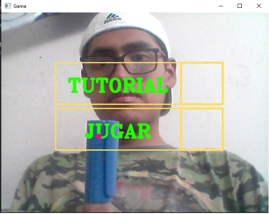
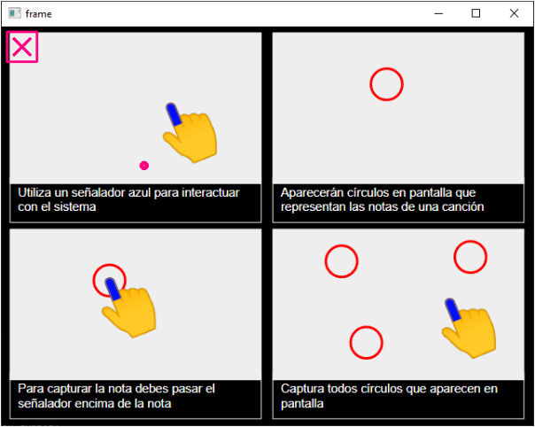
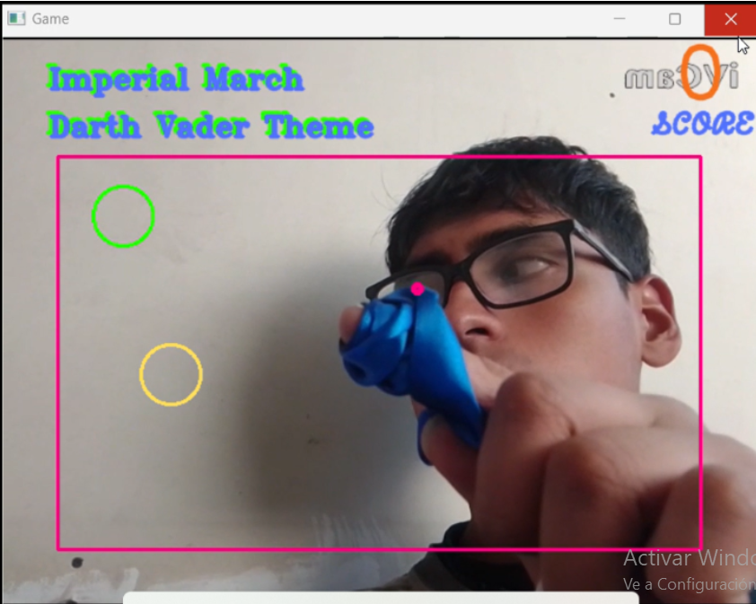

# Proyecto Final
### Curso: Computación Gráfica, Visión Computacional y Multimedia
## Integrantes:
 - Ccoscco Alvis, Italo Frankdux
 - Mayta Nolasco, Oliver Alessandro

## Instalación de Requerimientos
Para el presente proyecto se utilizó Python 3.8.10 el cual se considera la versión estable para instalar Numpy, una dependencia de OpenCV, sin embargo es posible que versiones más recientes de python admitan la instalación de OpenCV sin ningún problema.

Las versiones recomendadas y estables usadas en el proyecto se encuentran en el archivo "requirements.txt".
- Nota: Se recomienda usar un entorno virtual para evitar problemas de compatibilidad.
## requirements.txt
- imutils==0.5.4
- numpy==1.23.5
- opencv-contrib-python==4.6.0.66
- simpleaudio==1.0.4
## Interfaz
### Principal:
Al correr el programa  lo primero que veremos será esta interfaz la cual nos dará a elegir entre 2 opciones: 
- Tutorial: Nos mostrará una guía acerca de cómo jugar. 
- Jugar: Que nos introducirá formalmente en el juego.
NOTA: Tenemos que colocar el cursor en el cuadrado amarillo más resaltado, para elegir la opcion, es decir, es que está más a la derecha.

 
### Tutorial:
En esta interfaz nos informará acerca de cómo se procederá a jugar. 
NOTA: Para salir de esta interfaz, coloca el cursor en el cuadrado rojo.
 
### Juego:
Esta es la interfaz del juego propiamente, lo que se muestra en la esquina superior es el puntaje del usuario, y el rectángulo más grande, es el área donde aparecerán los círculos que van a reproducir las notas y finalmente en la parte superior se encuentra el nombre de la canción que se está reproduciendo 
 

